# Lauren Mercedes

<!-- Summary with overview image-->

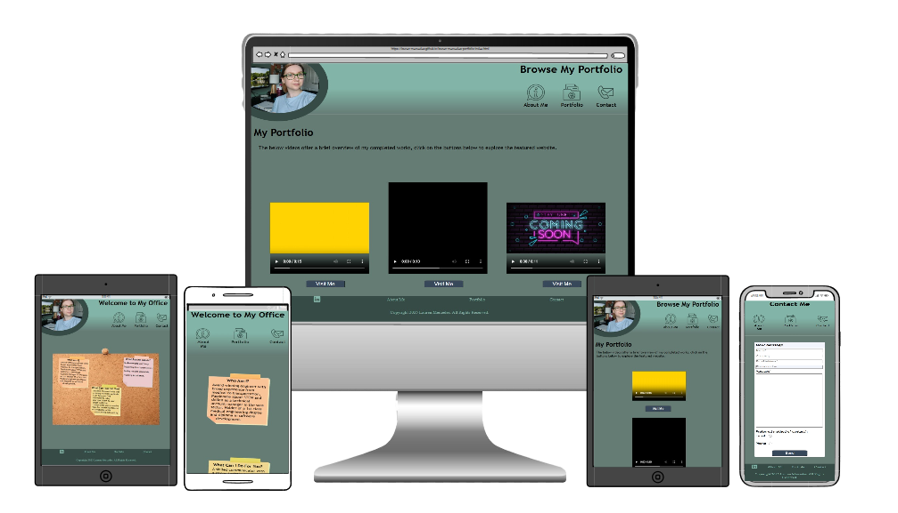
This website is a portfolio of my work providing potential clients and employers with information about my skill set, showcasing examples of my projects, and a way of contacting me.

 <!-- Link to website -->

[Click here](https://lauren-mercedes.github.io/lauren-mercedes-portfolio/index.html) to visit my website

<!-- Table of Contents -->

## Table of Contents

1.  [User Experience](https://github.com/Lauren-Mercedes/lauren-mercedes-portfolio?tab=readme-ov-file#user-experience---strategy)

    [- Strategy](https://github.com/Lauren-Mercedes/lauren-mercedes-portfolio#user-experience---strategy)

    [- Scope](https://github.com/Lauren-Mercedes/lauren-mercedes-portfolio#user-experience---scope)

    [- Structure](https://github.com/Lauren-Mercedes/lauren-mercedes-portfolio#user-experience---structure)

    [- Skeleton (wireframes)](https://github.com/Lauren-Mercedes/lauren-mercedes-portfolio#user-experience---skeleton)

    [- Surface](https://github.com/Lauren-Mercedes/lauren-mercedes-portfolio#user-experience---surface)

2.  [Features Overview](https://github.com/Lauren-Mercedes/lauren-mercedes-portfolio?tab=readme-ov-file#features-overview)

3.  [Testing](https://github.com/Lauren-Mercedes/lauren-mercedes-portfolio?tab=readme-ov-file#testing-and-fixes)

    [-Strategy Test](https://github.com/Lauren-Mercedes/lauren-mercedes-portfolio?tab=readme-ov-file#strategy-test)

    [-Features Testing](https://github.com/Lauren-Mercedes/lauren-mercedes-portfolio?tab=readme-ov-file#features-testing)

    [-Bugs & Fixes](https://github.com/Lauren-Mercedes/lauren-mercedes-portfolio?tab=readme-ov-file#bugs-and-fixes)

    [-Responsiveness](https://github.com/Lauren-Mercedes/lauren-mercedes-portfolio#responsiveness-test)

    [-Browser Compatability](https://github.com/Lauren-Mercedes/lauren-mercedes-portfolio#browser-compatibility-test)

    [-Validators (errors)](https://github.com/Lauren-Mercedes/lauren-mercedes-portfolio#markup-validation-service)

4.  [Deployment](https://github.com/Lauren-Mercedes/lauren-mercedes-portfolio?tab=readme-ov-file#deployment)

    [-Deployed Project Overview](https://github.com/Lauren-Mercedes/lauren-mercedes-portfolio?tab=readme-ov-file#deployed-project)

5.  [Credits](https://github.com/Lauren-Mercedes/lauren-mercedes-portfolio#credits)

        [- Acknowledgements](https://github.com/Lauren-Mercedes/lauren-mercedes-portfolio?tab=readme-ov-file#acknowledgements)

    <!-- line -->

---

<!-- User Experience Section including strategy, scope, structure, skeleton, and surface planning -->

## User Experience - Strategy

### Owner Goals

- Provide potential clients with information on the services available to them.
- Provide potential employers with examples of completed projects showcasing skills and knowledge.
- Provide a point of contact for queries.
- Encase the above information in a design that sparks interest in the user and represents the style of the owner.

### User Goals

As a user I want:

- intuitive navigation
- easy to read information
- easy to use features
- appealing design
- to be able to view the website across various screen sizes

#### Employers

As an employer I want:

- to see examples that provide evidence of your skills and experience
- to determine your communication style
- to assess if your personality and values fit with the opportunity

#### Clients

As a client I want:

- to understand what services you can provide
- to determine if your work aligns with how I want to be represented
- to be able to initiate contact

---

## User Experience - Scope

#### Features based on the user goals:

- responsive design
- navigation bar
  - located in the header for intuitive design
  - additional quick links in the footer for ease of use
- contact form
  - located on a separate contact page for quick navigation
- about me page
  - including easy to read informative content
- portfolio showcase page
  - with links and visual examples of work

---

## User Experience - Structure

Opening the website will start the user on the about me page.

- This will contain all the informative content about what services are provided, who I am, what my values are.
  - Using design and information this page will give the user an idea of my personality, communication style, and provide them with all the information they need to make a decision about continuing further.

Within the header there will be a navigation bar, visible across all pages for the user to navigate backwards and forwards between the pages, and within the footer there will be quick links so the user does not need to scroll to the top to move to another page. The footer will also provide a link to my LinkedIn for further information about me and another means of contact.

Moving on to the portfolio page.

- This will contain an overview of completed works including links to other projects.
  - Each project will be shown as a clickable video link for the user to have an insight as to the design of each project enabling quick navigation for what they want to see and an overview of my capabilities for decision making.

The next link along is the contact page

- This will contain a contact form.
  - The contact form will have sections to fill out user details and a message, some fields will be required, there will be a prominent send button.

---

## User Experience - Skeleton

Wireframes generated in Balsamiq

### About me page wireframe

### Portfolio page wireframe

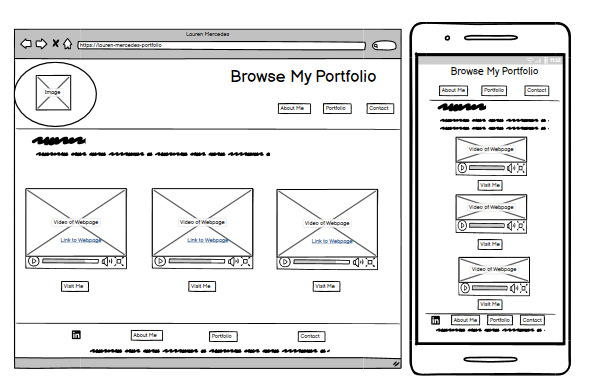

### Contact page wireframe

## 

## User Experience - Surface

### Design Elements

The style of the website is inspired by interactions within an office during a face to face meeting.

---

### Colour Scheme

The colours used for the website are a reflection of my personal office.
#364B45, #82B5A7 and #657C75 used as background colours to match my office walls with #38485B and #68798D as accents to make features stand out.

---

### Font

Trebuchet MS with a Sans-serif back-up was used throughout the webpage.

---

<!-- Overview of website features -->

## Features Overview

The overall design of the website is responsive across a variety of devices and follows the same colour scheme and locations throughout.

#### Navigation

The navigation bar uses consistent icons paired with text. Positioned within the header with the page title above the icons. This positioning is consistent across screen sizes, however, larger screens also display an image within the header.

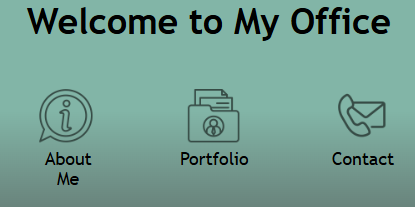

#### Home Page - About Me

The user starts on the About Me Page. This page displays all the information the user will need to understand the premise of the business.

Using sticky notes to group content with an added noticeboard background on larger screens. This design is to draw attention to the information displayed.

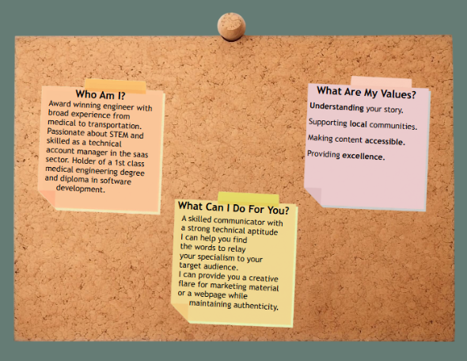

#### Portfolio Page

This page contains examples of previous work allowing the user to follow on from the information on the About Me page to see a showcase of skills outcomes.

Displaying videos with controls and a clickable link underneath. These videos will show screen recordings navigating through the website it is linked to once future projects are completed. In the interim they display a generic coming soon video and link to an in-progress page. This allows the user to select work that is more relevant to their needs for further viewing.

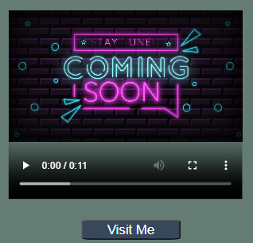

#### In Progress Page

A placeholder page for future work examples.

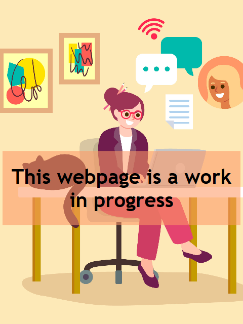

#### Contact Form

The contact form is inspired by writing a new email in Gmail, using the eye dropper extension to mimic the same colour styles for the background and integrating the colour scheme into the send button.

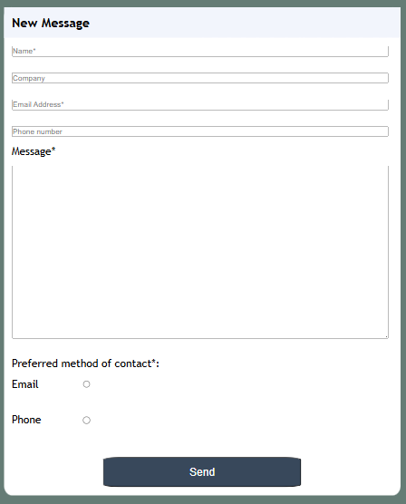

#### Footer

The footer contains quick links to enable the user to navigate the page without scrolling back to the top. It also includes a link to my LinkedIn page and a copyright statement.

---

<!-- Overview of testing and fixes including strategy test, features test, bugs, responsiveness, browser compatabilitty, and validations -->

## Testing and Fixes

### Strategy Test

How the website responds to the goals outlined in the strategy.

#### User Goals

As a user I want:

- intuitive navigation

The website starts the user on the about me page providing them with the information to decide if they would like to continue. With a navigation bar across all pages and quick links in the footer the user can easily find their way around the site.

- easy to read information

Colour contrasting and a simple font provides readability. Clearly defined headers and organised sections make information easy to find and read.

- easy to use features

All interactive features are in line with typical user expectations with either clear written labels or symbols a user will be used to seeing.

- appealing design

Styles and colours are used to grab attention and appeal visually. Using videos to allow for a quick view of examples and using styles that generate interest to display information.

- to be able to view the website across various screen sizes

The website is responsive across a variety of mobile, tablet and laptop screen sizes.

#### Employers

As an employer I want:

- to see examples that provide evidence of your skills and experience

This is shown on the portfolio page using videos and links allowing for a visual overview of examples and easy access to the corresponding work.

- to determine your communication style
- to assess if your personality and values fit with the opportunity

The wording and styles used throughout allow the user to gain an understanding of this.

#### Clients

As a client I want:

- to understand what services you can provide

The about me page gives an overview of what can be provided, clearly marked by a header in its own section.

- to determine if your work aligns with how I want to be represented

The portfolio page allows the user to browse previous works to get an understanding og this.

- to be able to initiate contact

The user can initiate contact via the form or the LinkedIn link in the footer.

### Features Testing

How the features outlined in the scope work. Each feature developed was generated with html, tested in [ Chrome DevTools](https://developer.chrome.com/docs/devtools/), styled with css, tested again in dev tools and adjusted until visual and functional criteria was met across mobile, tablet and laptop. These features were then tested again on push in the deployed environment.

- responsive design

Outlined in the responsiveness test the apearance and function works across a range of screen sizes.

- navigation bar
  - located in the header for intuitive design
  - additional quick links in the footer for ease of use

Clicking the links takes the user to the corresponding page. This works for both text and image on each navigation link.

The header and footer are consistent across all devices and the links are in the same location on each page.

- contact form
  - located on a separate contact page for quick navigation

The contact form has required inputs and will not allow submission until these are completed.

When the form is filled out and send selected a new tab is opened to display the submission was successful to the form dump.

Link for the form in the navigation bar and in the footer directs the user to the contact form.

When the send button has been selected it is highlighted as per the checked styles.

- portfolio showcase page
  - with links and visual examples of work

Video controls on each example video allows the user to play, pause, adjust sound, expand, adjust playback speed, download, and move to a picture in picture format.

Each visit me button takes the user to the in-progress page in another tab when selected.

When a button has been selected it is highlighted as per the checked styles.

### Bugs and Fixes

The main bugs experienced during the development of the website were:

- The link positioning of the text for the navigation bar.
  - Resolved by containing the text and image within a div and using flex properties to style.

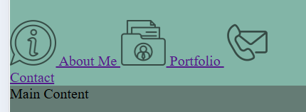

- A gap at the bottom of the webpage. - Resolved by removing a max-height property and adjusting element margins to fill the space.
  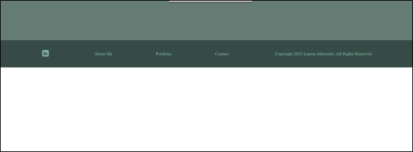

- A gap at the right of the webpage causing a horizontal scroll bar. - Resolved by adding an overflow-x property of hidden and adjusting the navigation bar margins.
  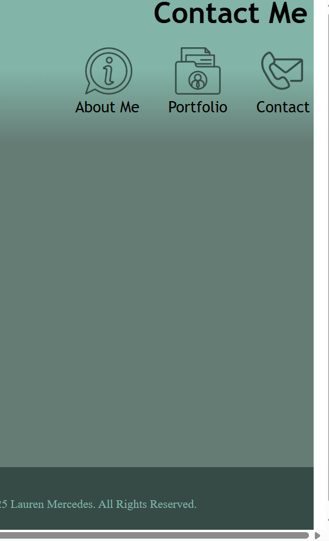

### Responsiveness Test

Website appearance and function was tested on the following devices using a mixture of dev tools and actual devices.

Phones

- iPhone SE
- iPhone XR
- iPhone 12 Pro
- iPhone 14 Pro Max
- Pixel 7
- Samsung Galaxy S8+
- Samsung Galaxy S20 ultra
- Galaxy Z Fold 5
- Samsung A51/71

Tablets

- iPad Mini
- iPad Pro
- iPad

Laptops and Desktops

- Nest Hub
- Nest Hub Max
- HP Laptop

### Browser Compatibility Test

Website appearance and function was tested on the following browsers:

- Google Chrome
- Microsoft Edge

### Markup Validation Service

I used this [HTML validator](https://validator.w3.org/#validate_by_input)
The errors found were as follows:

There were repeated occurrences of the above errors across all pages.

Error: no space between attributes was fixed by adding a space.

Error: element br not allowed was fixed by removing the element and adding a line height attribute to the list css.

Error: duplicate attribute was fixed by removing the duplicate.

Error: bad value was fixed by replacing back-slashes with forward-slashes on all links.

### CSS Validation Service

I used this [CSS validator](https://jigsaw.w3.org/css-validator/).
No errors were found.

<!-- Deployment section including project overview -->

## Deployment

This project was developed in VS Code, committed and pushed using the source control feature in VS Code connected to GitHub.

The website was deployed using GitHub Pages via the below steps:

1. Select repository.
2. Access settings.
3. Access the pages tab.
   - Ensure source is set to deploy from branch.
   - Select main branch and root.
4. Select Save.

Once save is selected a link will be generated for the website which will be available under deployments

### Deployed Project

#### Mobile

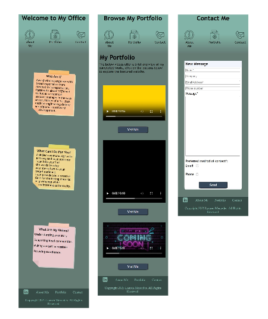

#### Tablet

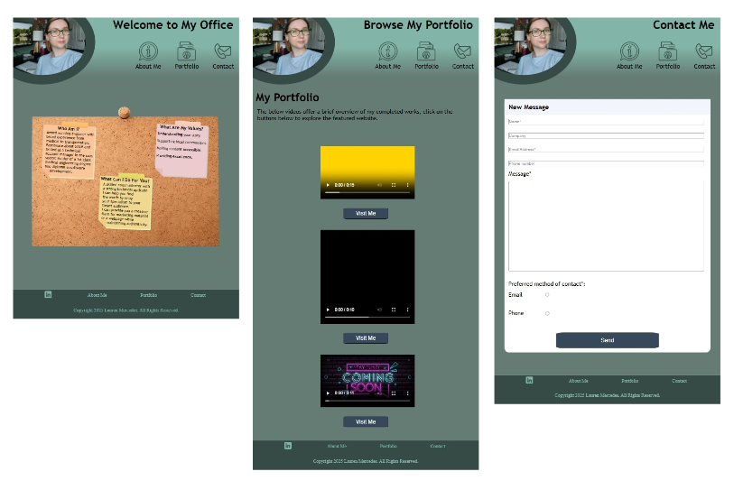

#### Laptop

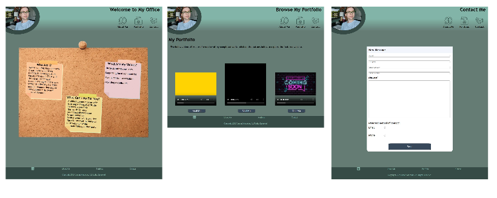

<!-- Credits for all tools used and acknowledgements for support -->

## Credits

All content and code was written by the developer.

[VSCode](https://code.visualstudio.com/)

- used to develop custom html and css for the website.

[Favicon](https://favicon.io/)

- Favicon on main webpages.
- Favicon on in-progress webpage.

[Freepik](https://www.freepik.com/)

- Icon images.
- Screen for videos.
- Video on portfolio page.
- Sticky notes.
- Noticeboard.

[Eyedropper Extension](https://www.eyedropper.org/)

For finding colours

- taken from Gmail and [Valspar](https://www.valsparpaint.co.uk/paint-colours/greens/secret-retreat/)

[Colour Palette](https://mycolor.space/?hex=%23634C3A&sub=1)

Used to generate a colour palette for the website based on the colours picked by the eyedropper.

[Balsamiq](https://balsamiq.com/)

Used to draw up wireframesa and summary image used in readme file.

[W3C CSS validator](https://jigsaw.w3.org/css-validator/)

- css validation testing

[W3C HTML validator](https://validator.w3.org/#validate_by_input)

- html validation testing

[ Chrome DevTools](https://developer.chrome.com/docs/devtools/)

- manual and responsiveness testing,

---

### Acknowledgements

Developed with the support of

- Marcel, my tutor.
- James, my partner.
- Raghav, my lecturer.
- The Code Institute, learning content provider.
- Slack community and fellow students.
